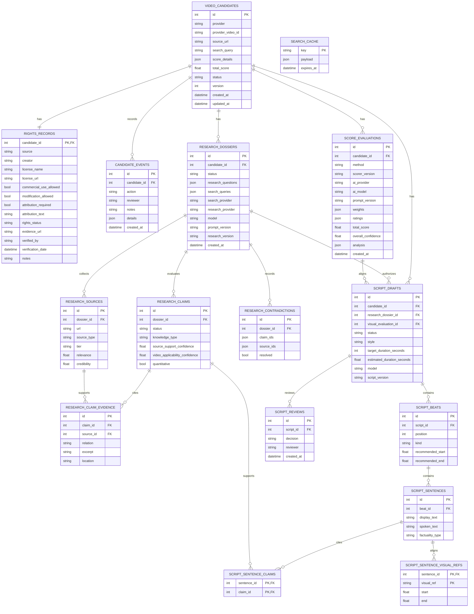
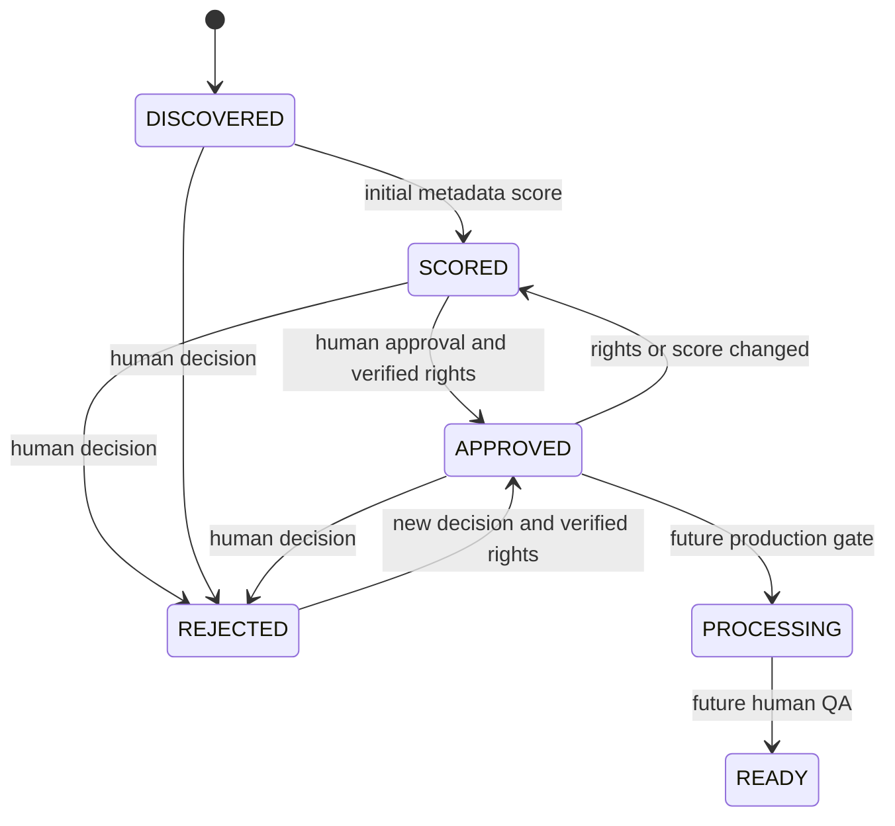
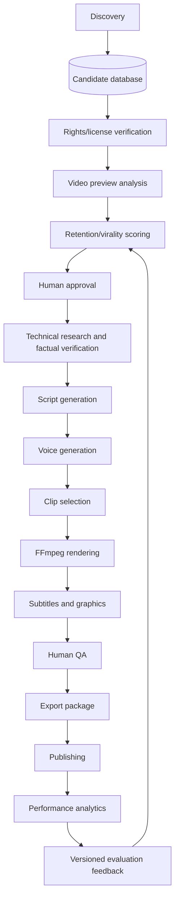

# Architecture and technical decisions

## Current implementation

This is a modular monolith: a single application with clearly separated boundaries, not distributed services. API and CLI share `DiscoveryService`, `ReviewService`, repositories and rights policy. Synchronous HTTP/SQLAlchemy keeps the first version small; FastAPI executes sync endpoints in its thread pool.

`VideoSourceProvider` normalizes catalog differences. `QueryGenerator`, `VideoScorer` and `VideoAnalysisProvider` are interchangeable contracts. `AIVideoScorer` depends on the analysis contract rather than Gemini classes; the Google SDK is isolated in `GeminiVideoAnalysisProvider`. `VideoAssetFetcher` is a separate, candidate-bound adapter for short-lived preview bytes. HTTP clients have timeouts and explicit lifetimes.

AI scoring is synchronous and explicit. It first checks for a successful evaluation with the same candidate, AI provider, model, prompt version and scorer version. A cache hit performs no download or paid model call unless `force=true`. Discovery never invokes AI scoring. The current implementation sends the video directly to Gemini, so Phase 2 adds no FFmpeg or frame-extraction dependency.

Technical research is also synchronous and explicit. `TechnicalResearchService` orchestrates `WebSearchProvider`, deterministic planning, `SourceRanker`, `SafeDocumentFetcher` and `ResearchAIProvider`. Gemini performs two narrow structured stages—evidence extraction and claim verification—while local code validates exact excerpts, source references, source tiers, quantitative claims and synthesis provenance. Read/review operations use a separate service and need no provider credentials.

Verified scripting is synchronous and explicit. `ScriptGenerationService` requires a human-verified dossier, builds a bounded factual allowlist and visual timeline, then calls `ScriptGenerationProvider` for structured generation and structured sentence auditing. Local rules validate provenance, quantitative references, cautious language, clickbait, duration and visual overlap. `ScriptReviewService` handles reads and human decisions without provider credentials.

Caption planning is deterministic and consumes the approved Phase 6 output, approved script sentences and persisted narration alignment. `CaptionPlanService` creates a final-output timeline with style and safe-area snapshots, while `ASSSubtitleRenderer` and `SRTSubtitleRenderer` serialize the plan without accepting arbitrary filter syntax. `FinalRenderService` reuses the existing FFmpeg process/probe boundary, stores a separate decorated MP4 and preview, and preserves the raw render unchanged. Only verified research claims may become factual overlays.

Only implemented modules have code directories. Future modules described below will be added when their contracts can be verified. There are no placeholder production workers or fake AI implementations.

## Data model

Phase 7 adds `CaptionPlan`, ordered `CaptionItem`, `GraphicOverlay`, `FinalRenderAsset` and `FinalRenderReview` records. They retain sentence/beat/claim provenance, final-timeline timing, safe-area and style snapshots, ASS/SRT paths, checksums, renderer versions and human decisions without modifying `RenderAsset`.

The complete candidate also contains title/description, preview/thumbnail links, author/profile, duration/dimensions/orientation, editorial object/process/category labels, and six current-score convenience fields. `score_evaluations` is append-only through the application and holds the reproducible history. Migration `0002` backfills the Phase 1 current score into that history. License fields exposed at candidate level are computed from the one-to-one rights record to avoid conflicting copies. Permissions are nullable: unknown is distinct from false.

Candidate IDs are internal integers; provider IDs remain strings. The provider column is extensible text. Status enums use portable string check constraints; adding a state requires an Alembic migration and explicit transition-policy changes. Times are aware UTC, restored when SQLite omits timezone information. JSON stores portable evaluation/evidence snapshots. B-tree indexes support identity, provider, editorial filters, status/score and event lookup.

## Transactions and duplicates

Each API/CLI operation commits atomically. API session cleanup runs in function scope, before a success response is sent. SQLAlchemy sessions are operation-scoped; no session or HTTP client is shared between requests.

Candidate identity uses a database unique constraint, a precheck and a savepoint. A competing duplicate insertion is recovered only if the matching identity exists; unrelated integrity errors are re-raised. SQLite transaction control is explicit so savepoints cannot accidentally commit outside the surrounding transaction. Audit events and score changes roll back together with the candidate.

Review writes use SQLAlchemy version-based optimistic concurrency. Rights changes touch the parent candidate so a concurrent approval cannot ignore that change. A stale review returns `409`. SQLite may still report locking errors under concurrent writes; production concurrency is outside the MVP acceptance criteria. PostgreSQL runtime/load testing is required before shared use.

Search-cache keys hash adapter schema version, provider, exact query, page and page size. Credentials are excluded. Normalized results (including empty pages and malformed-record counts) last 24 hours. Cache writes use SQLite/PostgreSQL upserts. There is no scheduled purge or distributed request lock yet; concurrent identical searches may consume duplicate API calls. Reusing an existing candidate never overwrites an editorial decision or score.

The first discovery query and labels are retained. A later `DiscoveryRun`/`CandidateDiscovery` relation can preserve all search associations without changing candidate identity. A future `VideoFingerprint` record and `DuplicateMatcher` will complement provider identity after rights-gated media access; cross-provider perceptual matching is not currently claimed.

## Rights and state transitions

`PROCESSING` and `READY` are reserved, not reachable through current commands. Repeating approval/rejection is idempotent. No score threshold grants approval automatically. Rights verification requires a named reviewer, notes, license/evidence references, commercial and modification permissions, and an attribution decision. `UNKNOWN`, `RESTRICTED` and `MANUAL_REVIEW_REQUIRED` always block approval. Full reassessment replaces previous fields and is audited. Rescoring does not reopen a rejected candidate.

Rendering checks current rights again before plan creation and execution; an earlier editorial approval does not substitute for an up-to-date rights check. Future workers and publishing integrations must keep that gate. Revocation still needs durable job cancellation and artifact quarantine when asynchronous jobs exist.

## Full target pipeline (implemented through Phase 8A)

| Pipeline boundary | Inputs → outputs | Persistent records / checks |
| --- | --- | --- |
| `services/narration` | Approved script + voice configuration → checked local audio | `VoiceProfile`, `NarrationAsset`, alignment, checksum, duration status and human review |
| `services/rendering` | Approved candidate/script/narration → planned and validated vertical MP4 | `VideoEditPlan`, `EditSegment`, `RenderAsset`, checksums, FFmpeg versions and review history |
| `services/captions` | Approved raw render + approved script/timing → accessible overlays and decorated MP4 | `CaptionPlan`, `CaptionItem`, `GraphicOverlay`, ASS/SRT, `FinalRenderAsset`, checksum, preview and review history |
| `web` dashboard | Candidate and artifact evidence → local decisions | Jinja2 views, bounded queries, ID-based media, process-local CSRF and existing review services |
| `services/publishing` | QA-approved export → platform post | `Publication`, platform ID, consent, idempotency key and status |
| `services/analytics` | Platform metrics → evaluation feedback | `PerformanceSnapshot`, capture time, exposure context and experiment cohort |

Audio and render artifacts live in configurable local storage with checksums and SQL references, not database blobs. Add durable `Job` records (pending/running/succeeded/failed/cancelled), idempotency keys, bounded retries and an outbox before introducing background workers. Every future job should persist input versions and output manifests so human decisions remain traceable. n8n may trigger internal API operations and inspect job states; it must not bypass rights/approval policies or contain the core domain rules.

## Local operational boundary

Phase 8A adds `app/web` without adding database models. Jinja2 pages are rendered by the existing FastAPI process; the REST API and CLI remain intact. Dashboard reads use paginated/batched queries and eager loading for nested detail. Mutations call existing domain services, and page loads never trigger external or paid work. Four media routes accept only persisted IDs and resolve relative paths under configured roots. Browser forms use a random process-local synchronizer token. This is appropriate for a loopback-bound single-user tool, not shared hosting; see `docs/dashboard.md`.

No authentication, publishing integration, general download worker, remote deployment or telemetry exporter is included. An explicit AI-score action can make one paid Gemini analysis. A fresh research action makes bounded Brave requests, bounded page fetches and two Gemini calls. Script generation makes two Gemini calls per explicitly requested variant, with one variant by default and three maximum. Explicit narration makes one ElevenLabs request for the complete approved text. Rendering is explicit and synchronous, reacquires one known provider preview, runs one bounded FFmpeg process and validates it with ffprobe. Credentials use `SecretStr` and local environment configuration. Third-party URLs, document content, credentials and prompts are excluded from application logs.

The asset fetcher accepts only HTTPS preview URLs tied to known Pexels/Pixabay candidates and exact provider CDN allowlists. It rejects credentials in URLs, nonstandard ports, redirects, excessive duration, excessive declared or streamed size, unsupported MIME types and mismatched file signatures. Temporary names are OS-generated and removed after success or failure. Gemini uploads are also deleted in a `finally` block.

Research URL safety uses HTTPS-only URLs, no credentials or nonstandard ports, public-address DNS checks, disabled redirects, robots policy, MIME and streamed-size limits. Only short exact claim excerpts are persisted; full retrieved documents are transient. DNS rebinding between validation and connection remains a known limitation of the simple local HTTP client and must be hardened before remote multi-user deployment.

Add authenticated roles, secret management, quota coordination, backups, monitoring and PostgreSQL integration tests when preparing a multi-user deployment. Docker/Compose becomes useful at that point or when adding real worker dependencies, rather than as an unused requirement now.
